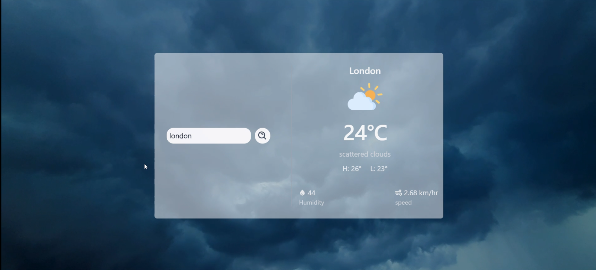
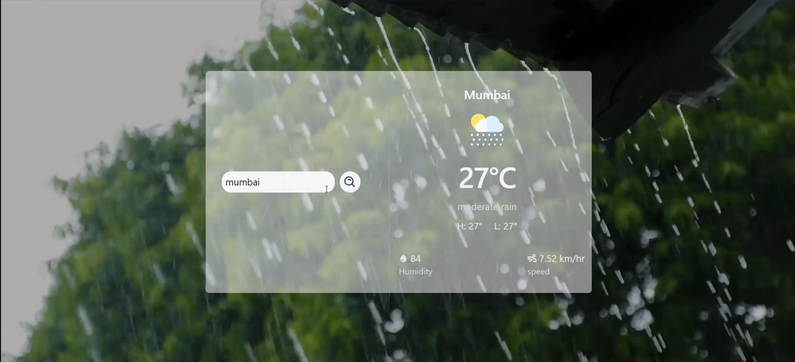
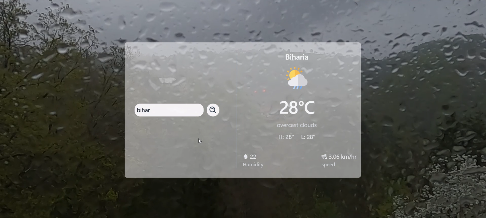

# 🌦️ Weather App

A modern and responsive Weather Application built with **React**, **Vite**, and **Tailwind CSS** that provides real-time weather information using the **OpenWeather API**. The application features dynamic weather-based backgrounds, custom weather icons, and a clean glassmorphism-inspired interface to create an engaging user experience.

---

## 📖 About the Project

This project was developed to strengthen my understanding of **REST API integration** in React applications. While building it, I explored how to fetch real-time data from an external API, manage asynchronous operations, share state using the Context API, and dynamically update the user interface based on live weather conditions.

The application demonstrates practical frontend development concepts while focusing on creating a responsive and visually appealing user experience.

---

## ✨ Features

- 🔍 Search weather by city name
- 🌡️ Real-time temperature (°C)
- 🌤️ Dynamic weather icons
- 🎥 Weather-based animated video backgrounds
- 💧 Humidity information
- 💨 Wind speed display
- 🌡️ Maximum & Minimum temperatures
- 📱 Fully responsive design
- ⚡ Fast loading with Vite
- 🎨 Modern glassmorphism-inspired UI
- 🌈 Dynamic background changes according to weather conditions
- 🔄 Live weather updates

---
## 📸 Screenshots

### Cloudy Weather



---

### Rainy Weather



---

### Drizzle Weather


---

## 🛠️ Technologies Used

- React.js
- Vite
- Tailwind CSS
- JavaScript (ES6+)
- Context API
- OpenWeather API
- React Icons

---

## 📚 What I Learned

Building this project helped me gain practical experience with:

- Consuming REST APIs
- Working with asynchronous JavaScript (`fetch`, `async/await`)
- Managing component state using React Hooks
- Sharing data with Context API
- Conditional rendering in React
- Error handling for API requests
- Environment variables using Vite
- Responsive UI development with Tailwind CSS
- Component-based application architecture
- Dynamic UI updates based on API responses

---

## 📂 Project Structure

```
weather_app/
│
├── public/
│
├── src/
│   ├── assets/
│   │   ├── bg-video/
│   │   ├── icons/
│   │   └── images/
│   │
│   ├── context/
│   ├── App.jsx
│   ├── Weather_card.jsx
│   ├── main.jsx
│   └── index.css
│
├── package.json
├── vite.config.js
└── README.md
```

---

## 🚀 Getting Started

### Clone the repository

```bash
git clone https://github.com/aymansiddiqui2006/Weather-App.git
```

### Navigate to the project

```bash
cd Weather-App/weather_app
```

### Install dependencies

```bash
npm install
```

### Create an environment file

Create a `.env` file in the project root.

```env
VITE_WEATHER_API_KEY=YOUR_OPENWEATHER_API_KEY
```

### Run the development server

```bash
npm run dev
```

---

## 🌐 API Used

This project uses the **OpenWeather API** to retrieve real-time weather information.

The API provides:

- Current Weather
- Temperature
- Humidity
- Wind Speed
- Weather Conditions
- Weather Icons

---

## 🎯 Future Improvements

- 📍 Current location weather using Geolocation
- 📅 7-Day weather forecast
- 🕒 Hourly forecast
- 🌅 Sunrise & Sunset timings
- 🌙 Dark / Light mode
- ❤️ Favourite cities
- 🌍 Multi-language support
- 📊 Air Quality Index (AQI)
- ✨ More advanced animations and transitions

---

## 👨‍💻 Author

**Ayman Siddiqui**

GitHub: https://github.com/aymansiddiqui2006

---

## ⭐ Acknowledgements

- OpenWeather API
- React
- Vite
- Tailwind CSS
- React Icons

---

If you found this project helpful or interesting, consider giving it a ⭐ on GitHub.
